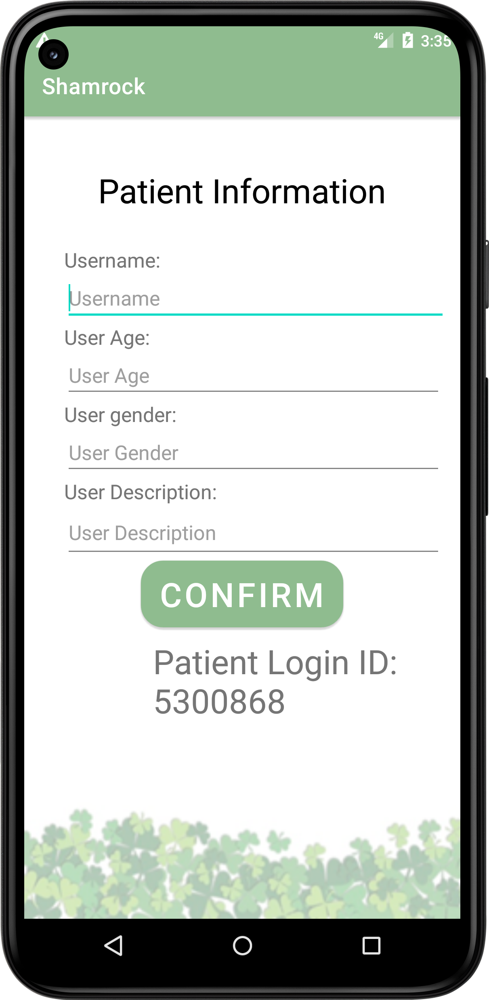
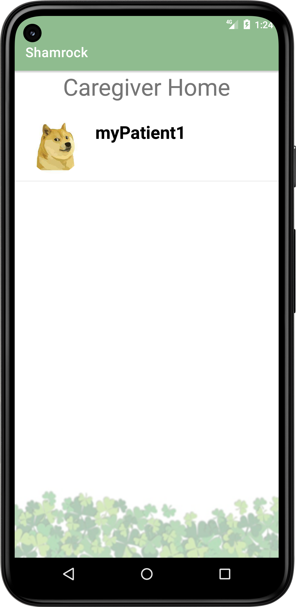

# Shamrock
 
## Description
This application will have two target users, mainly the patients suffering from dementia and their caregivers.
Shamrock enables the caregivers to set specific schedules and tasks for their patients. It will allow caregivers to set schedules for more than one patient. Shamrock allows caregivers to manage more than one dementia patient in an effective and efficient manner. Another unique feature of this application is it gives caregivers the ability to verify if a certain task has been done by the patient or not.
Shamrock reminds patients of tasks, which help them keep up with their daily schedule. This application is easy to use and interactive which grabs the interest of the user and helps them perform their day-to-day task with ease. As Shamrock keeps the dementia patients busy and involved in different interactive tasks it may help them prevent hallucinations by keeping them occupied. This application is very beneficial for dementia patients as it encourages them to partake in various mental exercises by making them perform tasks in a timely manner. Keeping a regular routine can alleviate the stress of dementia as the disease progresses. Shamrock instills independence which encourages the PWD to feel good and productive about themselves.
 
# Different files in our code and what is their significance…
 
 | File Name | Description |
| ------ | ------ |
| MainActivity | Let the user choose Patient or Caregiver |
| MainActivity2 | The caregiver can create an account or login with their existing account |
| MainActivity3 | The homepage for the caregiver |
| MainActivity4 | The page for editing patient tasks |
| MainActivity5 | This file has all the features for a working alarm for the application |
| MainActivity6 | Let the caregiver to add their patient |
| Patient | This class provides methods for storing information regarding the patient in the database |
| Caregiver | This class provide methods for storing information regarding the caregiver |
| Task | This is a class which helps to store alarm in database |
| Schedule | This is class for storing the date of the schedule |
| AlarmReceiver| This file is used to show the pop-up notification to the user |
| DestinationActivity | This basically an separate page which open after the alarm is stopped |
 **Rest of the java files which are not mentioned in the above table are for future use. 
 
 
 
## Steps to Run our application
 
**Step 1:** Clone Repo 
**Step 2:** Open in Android Studio, build and view in emulator Ensure that your emulator has at least 
<ul>
   <li>Target API level 19 (Kitkat) or higher</li>
   <li>Uses Android 4.0 or higher</li>
</ul>
 
Personally our emulator is
<ul>
   <li>Pixel 5</li>
   <li>API Level 22 Lollipop</li>
   <li>Android 5.1</li>
</ul>
However, default emulator works fine as well
 
<h1>Application Features </h1>
<ul>
   <li>Can read and write to firestore Cloud</li>
   <li>Can Switch pages</li>
   <li>Basic methods of Caregiver, Patient, Task, and Schedule class needed for database have been implemented </li>
   <li>Allows the user to choose their role either caregiver and patient </li>
   <li>Allows the caregiver to create an account and login </li>
   <li>Checks if the user enters a well formatted email address </li>
   <li>Checks that the user enters a 6 digit/symbol/alphabet/character password </li>
   <li>Checks if that particular account already exist or not </li>
   <li>Allows the caregiver to login in an already created account </li>
   <li>If the caregiver account is new then the app allows to add new patient information </li>
   <li>For patient information it takes in Name, Age, Unique Id, Sex, Description </li>
   <li>Allows the caregiver to scroll through the patient list </li>
   <li>Allows the caregiver to choose a particular patient </li>
   <li>Allows the caregiver to edit patient information </li>
   <li>Allows to select the date for the schedule </li>
   <li>Can Set Alarm </li>
   <li>Notifies the user when the alarm rings </li>
   <li>Allows the user to cancel the set alarm </li>
   <li>Allows the user to stop the alarm and takes it to the notification activity page </li>
</ul>
 
 
 
 
<h1> Procedure</h1>
If emulator has been setup correctly then it should take a couple moments for the app to startup 
Then you should see this screen 
<h4> Choosing User Type Page</h4> 

 
 
 
 
 
 
<ul>
<li>     The [Patient] button will take the user to patient interface of the application</li>
<li></li>
<li>	The [Caregiver] button will take the user to caregiver interface of the application </li>
</ul>
 
 
 
 
 
 
 
 
 
 
 
 
 
 
 
<h4>Caregiver Login Page</h4>

 
 
 
 
 
 
 
 
 
 
 
<ul>
<li>	To create an account email must be unique, username does not have to match</li>
<li>	When logging in the Caregiver email and password must be correct</li>
<li></li>
<li>	The [Create Account] will lead the caregiver user to create a patient</li>
<li></li>
<li>	The [Log In] button will lead the user to the Caregiver home page </li>
</ul>
 
 
 
 
 
 
 
<h4>Creating Patient</h4>

 
 
 
 
 
 
 
 
Add information about the patient 
Adding User Description is optional 
 
The [CONFIRM] button add the patient information in the database and lead caregiver to the Caregiver Homepage 
 
 
 
 
 
 
 
 
 
 
 
 
 
<h4>Caregiver Homepage</h4>

 
 
 
 
 
 
 
 
 
Click and Drag to scroll list of patients 
 
Click on any patient to be lead to edit the Schedule of that particular patient 
 
 
 
 
 
 
 
 
 
 
 
 
 
<h4>Edit Patient’s Schedule Page</h4>

 
 
 
 
 
 
 
 
 
Must select Date before entering a New Task, otherwise system will prompt you to select a date 
The [Select Date] field allows to select date 
 
The [Edit Patient] button allows to edit patient information, it will lead to the same page as ‘Creating Patient’ 
 
The [New Task] button allows to create new task for patient like alarm 
 
 
 
 
 
 
 
 
 
<h4>Calendar</h4>

 
 
 
 
 
 
 
Should be able to choose any date and exit without setting a date as well 
 
 
 
 
 
 
 
 
 
 
 
 
 
 
 
 
 
<h4>Notification</h4>

 
 
 
 
 
 
 
 
 
The [Select Time] will prompt you to enter a time and will automatically add it to the database and set it to ring at the selected time 
 
The [Cancel Alarm] allows to cancel the already set alarm, must select a time to cancel otherwise it will prompt you to select a time 
 
The alarm has a delay which we plan to fix, it may not ring exactly on the minute, sometimes it is even one minute behind, but when the notification pops up it will appear as it does in the photo 
 
You can click on the notification and it will automatically open another page, we hope to use this page to display the task in the coming sprint 
 
 
 
 
 
 
 
 
<h4>Selecting Time</h4>

 
 
 
 
 
 
 
 
  The user can set time using the dial 
 
 
 
 
 
 
 
 
 
 
 
 
 
 
 
 
 
 
 

