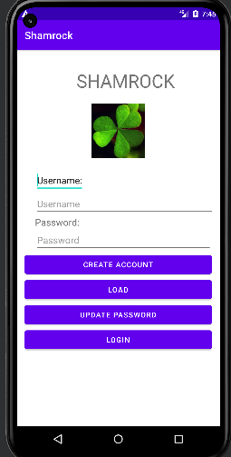

 <h1>Shamrock </h1>
<h1>Description</h1>
This application will have two target users, mainly the patients suffering from dementia and their caregivers. 
Shamrock enables the caregivers to set specific schedules and tasks for their patients. It will allow caregivers to set schedules for more than one patient. Shamrock allows caregivers to manage more than one dementia patient in an effective and efficient      manner. Shamrock has an amazing feature of GPS tracking which allows the caregivers to keep track of the live location of their patients. Another unique feature of this application is it gives caregivers the ability to verify if a certain task has been done by the patient or not.
Shamrock reminds patients of tasks, which help them keep up with their daily schedule. This application is easy to use and interactive which grabs the interest of the user and helps them perform their day-to-day task with ease. As Shamrock keeps the dementia patients busy and involved in different interactive tasks it may help them prevent hallucinations by keeping them occupied. This application is very beneficial for dementia patients as it encourages them to partake in various mental exercises by making them perform tasks in a timely manner. Keeping a regular routine can alleviate the stress of dementia as the disease progresses. Shamrock instills independence which encourages the PWD to feel good and productive about themselves.

<h1>Steps to Run our application</h1>

**Step 1:** Clone Repo  
**Step 2:** Open in Android Studio, build and view in emulator Ensure that your emulator has at least 
<ul>
    <li>Target API level 19 (Kitkat) or higher</li>
    <li>Uses Android 4.0 or higher</li>
</ul>

Personally our emulator is 
<ul>
    <li>Pixel 5</li>
    <li>API Level 22 Lollipop</li>
    <li>Android 5.1</li>
</ul>
However, default emulator works fine as well 

<h1>Different files in our code and what is their significance…</h1>
 
 
| File Name | Description |
| ------ | ------ |
| MainActivity | cell |
| MainActivity2 | cell |

**MainActivity** ->
 
**MainActivity**

<h1>Application Features </h1>
<ul>
    <li>Can read and write to firestore Cloud</li>
    <li>Can Switch pages</li>
    <li>Basic methods of Caregiver, Patient, Task, and Schedule class needed for database have been implemented </li>
    <li>Allows the user to choose their role either caregiver and patient </li>
    <li>Allows the caregiver to create an account and login </li>
    <li>Checks if the user enters a well formatted email address </li>
    <li>Checks that the user enters a 6 digit/symbol/alphabet/character password </li>
    <li>Checks if that particular account already exist or not </li>
    <li>Allows the caregiver to login in an already created account </li>
    <li>If the caregiver account is new then the app allows to add new patient information </li>
    <li>For patient information it takes in Name, Age, Unique Id, Sex, Description </li>
    <li>Allows the caregiver to scroll through the patient list </li>
    <li>Allows the caregiver to choose a particular patient </li>
    <li>Allows the caregiver to edit patient information </li>
    <li>Allows to select the date for the schedule </li>
    <li>Can Set Alarm </li>
    <li>Notifies the user when the alarm rings </li>
    <li>Allows the user to cancel the set alarm </li>
    <li>Allows the user to stop the alarm and takes it to the notification activity page </li>
</ul>
 
 
 
 
<h1> Procedure</h1>
 
 
If emulator has been setup correctly then it should take a couple moments for the app to startup 
Then you should see this screen 

 
 
 
 
 
 
 
 
<ul>
<li>The [Patient] button will take the user to patient interface of the application</li>
<li>The [Caregiver] button will take the user to caregiver interface of the application </li>
</ul>
 
 
 
 
 
 
 
 
 
 
 
 
 
 
 
 
 
 
 
 
 
</ul>
 

After selecting one out of two options (Patient/Caregiver) 
Then you should see this screen 

 
 
 
 
 
 
 
 
 
<ul>
<li>The [Create Account] button should store the username and password in the database</li>
<li>The [Log In] button will lead the user to the Caregiver home page </li>
</ul>
 
 
 
 
 
 
 
 
 
 
 
 
 
 
 
 
 
 
 
 
 
 
 
</ul>

 
After clicking on create account 
Then you should see this screen 

 
 
 
 
 
 
 
 
Then you can add information about the patient 
that needs to be added in the database 
The **CONFIRM** button add the patient information in the database 
 
 
 
 
 
 
 
 
 
 
 
 
 
 
 
 
 
 
 
 
 
</ul>

 
After clicking on login 
Then you should see this screen 

 
 
 
 
 
 
 
 
 
Caregiver can choose patients from this list 
 
 
 
 
 
 
 
 
 
 
 
 
 
 
 
 
 
 
 
 
 
</ul>
 
After clicking on a particular patient 
Then you should see this screen 

 
 
 
 
 
 
 
 
 
The **Date** button allows to select date 
The **Edit Patient** button allows to edit patient information 
The **New Task** button allows to create new task for patient like alarm 
 
 
 
 
 
 
 
 
 
 
 
 
 
 
 
 
 
 
 
 
 
</ul>
 
After clicking on Date 
Then you should see this screen 

 
 
 
 
 
 
 
 
 
 
 
 
 
 
 
 
 
 
 
 
 
 
 
 
</ul>
 
 
 
 
 
 
 
 
 
 
After clicking on Edit Patient 
Then you should see this screen 

 
 
 
 
 
 
 
 
 
 
 
 
 
 
 
 
 
 
 
 
 
 
 
 
</ul>
 
 
 
 
 
 
 
 
 
 
 
After clicking on New task 
Then you should see this screen 

 
 
 
 
 
 
 
 
 
The **Select Time** allows to select time for the alarm to ring and it also sets the alarm 
The **Cancel Alarm** allows to cancel the already set alarm 
 
 
 
 
 
 
 
 
 
 
 
 
 
 
 
 
 
 
 
 
 
</ul>
 
After clicking on Select time  
Then you should see this screen 

 
 
 
 
 
 
 
 
  The user can set time using the dial or manually adding the time 

